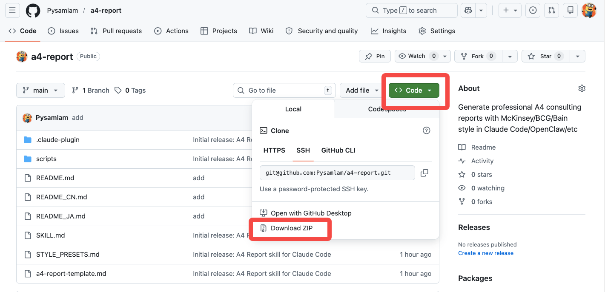
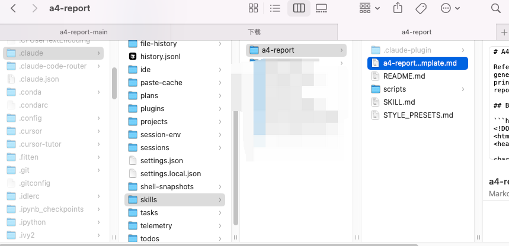
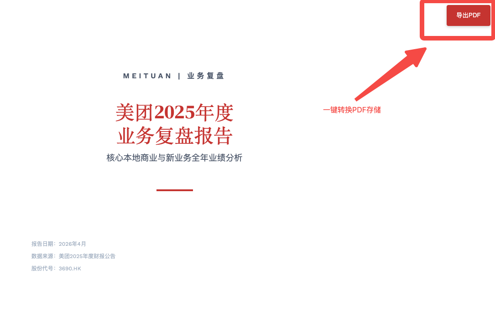

# A4 Report — Claude Code 向けコンサルティングレポート生成スキル

> マッキンゼー / BCG / ベイン スタイルのプロ仕様 A4 コンサルレポートを生成 —— デザインスキル不要、ゼロ依存、ブラウザから即 PDF 出力。


[English](README.md) | [中文](README_CN.md) | **日本語**

---

## 概要

**A4 Report** は Claude Code のスキルです。テーマまたはデータを入力するだけで、印刷対応のコンサルティングレポートを生成します。出力物は**単一の自己完結型 HTML ファイル**——Node.js も Python もビルドツールも不要。ブラウザで開く → 印刷 → PDF として保存、以上です。

**主なユースケース：**
- 市場分析・競合調査レポート
- 戦略立案・フィジビリティスタディ
- 事業レビュー・取締役会向け資料
- クライアント提案書・デューデリジェンスサマリー

---

## クイックスタート

### Step 1 — インストール

**方法 A：手動インストール**
> ZIP をダウンロード → 解凍 → ターゲットフォルダに入れる：



```bash
# 1. このリポジトリを ZIP でダウンロードし解凍
# 2. ターゲットフォルダを作成（手動でも可）
mkdir -p ~/.claude/skills/a4-report
# 3. 解凍した全ファイルをコピー（手動でも可）
cp SKILL.md STYLE_PRESETS.md a4-report-template.md ~/.claude/skills/a4-report/
```



### Step 2 — 呼び出し

Claude Code で `/a4-report` と入力し、必要な内容を説明します：

```
/a4-report

中国の新エネルギー車市場分析レポートを書いてください。
対象：取締役会、スタンダード版（10〜15ページ）。
```

```
/a4-report

Write a competitive intelligence report on the top 3 cloud providers,
McKinsey style, 10-15 pages, for internal strategy review.
```

### Step 3 — レポート受け取り

Claude が簡単な確認事項を質問し、HTML ファイルを生成して自動で開きます。ブラウザから PDF に印刷して完成です。


---

## 仕組み — 7フェーズワークフロー

```
フェーズ 1：コンテンツ確認    → 読者層・レポート種別・目的・分量
フェーズ 2：スタイル選択      → 3スタイルをプレビューまたは直接選択
フェーズ 3：レポート生成      → インライン CSS 付き完全 HTML、ゼロ依存
フェーズ 4：グラフ注釈付加    → 全グラフに読み方ガイド＋主要インサイトを自動追加
フェーズ 5：納品              → ブラウザで開き、印刷準備完了
フェーズ 6：PDF エクスポート  → ブラウザ印刷のステップバイステップ案内（任意）
フェーズ 7：データ監査        → ソースデータと全数値を自動照合（データ提供時）
```

スキルは必要なことだけを質問し、その後は中断なくレポートを生成します。

---

## 使い方ガイド

### 基本的な使い方 — テーマのみ

最もシンプルな使い方：テーマを与え、スタイルを選び、レポートを受け取る。

```
/a4-report

東南アジアのクイックコマース市場参入レポートを作成してください。
```

Claude が順番に確認します：
1. **読者層** — 誰が読む？（経営幹部 / 取締役会 / 事業責任者 / コンサルタント）
2. **レポート種別** — 市場分析 / 競合調査 / 戦略立案 / 事業レビューなど
3. **目的** — 投資判断 / 取締役会報告 / クライアント提案など
4. **分量** — 簡潔版（5〜8ページ）/ スタンダード版（10〜15ページ）/ 詳細版（20ページ以上）
5. **スタイル** — マッキンゼーブルー / BCG シルバー / ベインレッド（プレビュー後に選択可）

### 応用的な使い方 — ソースデータあり

データファイルをアップロードまたは参照すると、**データ自動監査**（フェーズ 7）が起動します：

```
/a4-report

添付の Excel データをもとに、美団（Meituan）2025年度
財務レビューレポートを作成してください。
対象：経営幹部、マッキンゼースタイル、スタンダード版。
```

生成後、フェーズ 7 が自動実行されます：
- レポート内の全数値を抽出
- ソースファイルと照合
- 幻覚の疑い ⚠️ および確認済みエラー ❌ をフラグ
- 正確率を表示し、自動修正を提案

**監査出力サンプル：**
```
╔══════════════════════════════════════════════════╗
║              🔍  データ監査開始                   ║
╠══════════════════════════════════════════════════╣
║  レポートファイル: meituan-review-2025.html      ║
║  ソースデータ: data.xlsx                         ║
╚══════════════════════════════════════════════════╝

✅ 検証済み:       12 件
⚠️ 幻覚の疑い:      2 件  （要人工確認）
❌ データエラー:    1 件  （要修正）

📊 正確率: 80%
```

### スタイル選択

3つのプリセット、それぞれ異なるコンサルティングファームの美学を体現：

| スタイル | ビジュアル | 適したシーン |
|---------|-----------|------------|
| **マッキンゼーブルー** | ディープネイビー＋ホワイト、セリフ見出し（Playfair Display） | 経営幹部向け、正式レポート |
| **BCG シルバー** | チャコール＋幾何学レイアウト、クリーンなサンセリフ（Inter） | 構造化分析、戦略資料 |
| **ベインレッド** | 太字の赤アクセント、インパクトある数字（DM Serif Display） | データ重視レポート、業績レビュー |

「プレビューを見る」を選択すると、Claude が3種類の単ページ HTML プレビューを生成します。見比べてから選択できます。

### トリガーワード

以下のいずれかでスキルが起動します：

**日本語：** レポートを書く / 分析レポート / 市場分析 / 競合分析 / 戦略レポート / マッキンゼースタイル / コンサルレポート / A4レポート

**中国語：** 写报告 / 生成报告 / 市场分析报告 / 竞品分析报告 / 战略报告 / 麦肯锡风格

**英語：** write a report / consulting report / A4 report / market analysis / competitive intelligence / strategic report / business report

---

## 主な機能

### ゼロ依存出力
全レポートは**単一の HTML ファイル**で CSS をインライン化。npm も Python もビルドも不要。ブラウザがあればどのデバイスでも動作します。

### グラフ注釈システム
全グラフに自動で付与：
- **📊 読み方ガイド（Chart Guide）** — 軸・色の意味・注目すべき点を解説
- **💡 主要インサイト（Key Insights）** — トレンド判断、比較発見、アクション示唆

「グラフを見てもよくわからない」という状況を解消します。

### 印刷最適化レイアウト
- 正確な A4 フォーマット：210mm × 297mm
- `@page { size: A4; }` メディアクエリで完全な PDF レンダリング
- スマートな改ページ——セクション見出しがページ末尾に取り残されない
- 印刷モードで背景グラフィックを保持

### 読者層対応コンテンツ
事前に読者層を選ぶと、レポート内容が自動調整されます：
- **経営幹部 / C-Suite** → 結論ファースト、データ重視、意思決定に特化
- **取締役会 / 投資家** → ROE・キャッシュフロー・戦略価値を強調
- **事業責任者** → 業務レベルの分析と実行可能な提案
- **外部クライアント** → 価値提案とパートナーシップのハイライト

### コンサルティング品質のレポート構成
全レポートが標準的なコンサルティング階層に従います：
1. 表紙
2. エグゼクティブサマリー（主要所見 3〜5 件）
3. 目次
4. 主要発見事項（タイトル＋根拠＋示唆）
5. 詳細分析（グラフ・フレームワーク・データ）
6. 戦略的提言（優先順位付き、実行可能）
7. 附録（データ表・方法論）

---

## PDF への書き出し

1. 生成された HTML を Chrome または Safari で開く
2. `Cmd+P`（Mac）または `Ctrl+P`（Windows）を押す
3. 送信先 → **PDF として保存**
4. 用紙サイズ → **A4**
5. **背景のグラフィック** にチェックを入れる
6. 保存

レポートには印刷ボタン（打印 / Save as PDF）が内蔵されています。クリックで印刷ダイアログが開きます。

---

## ファイル構成

```
a4-report-main/
├── SKILL.md                  # コアワークフロー — 常時ロード
├── STYLE_PRESETS.md          # 3つのコンサルスタイル — フェーズ 2 でロード
├── a4-report-template.md     # A4 HTML アーキテクチャ — フェーズ 3 でロード
├── scripts/
│   ├── audit-checklist.md    # データ監査ガイド — フェーズ 7 でロード
│   └── export-pdf.sh         # PDF エクスポート参照
└── .claude-plugin/
    ├── marketplace.json
    └── plugins/a4-report/
```

スキルは**プログレッシブローディング**設計を採用——各フェーズで必要なファイルのみをロードし、コンテキストを軽量に保ちます。

---

## 動作要件

- [Claude Code](https://claude.ai/claude-code) CLI
- モダンブラウザ（Chrome / Safari / Firefox）— PDF エクスポート用

---

## ライセンス

MIT — センスが、すべてを決める。
